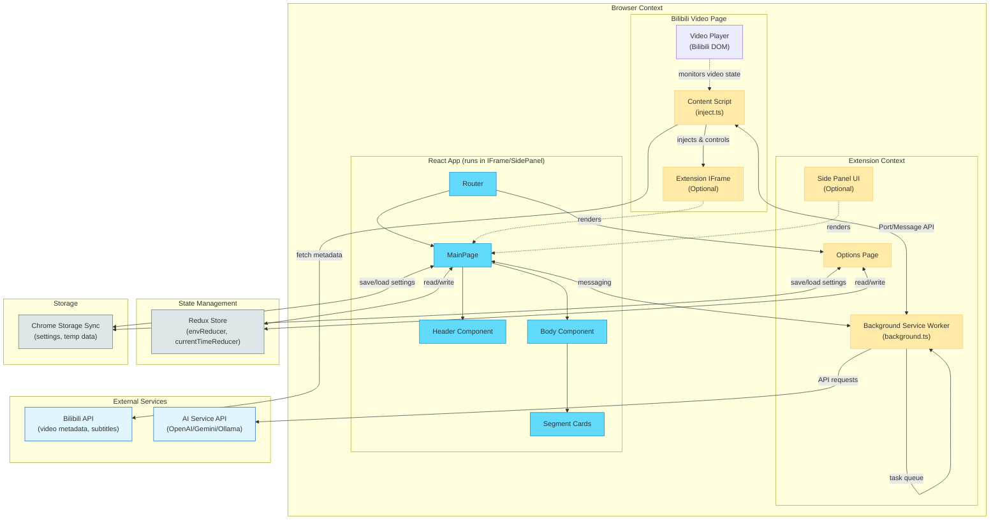
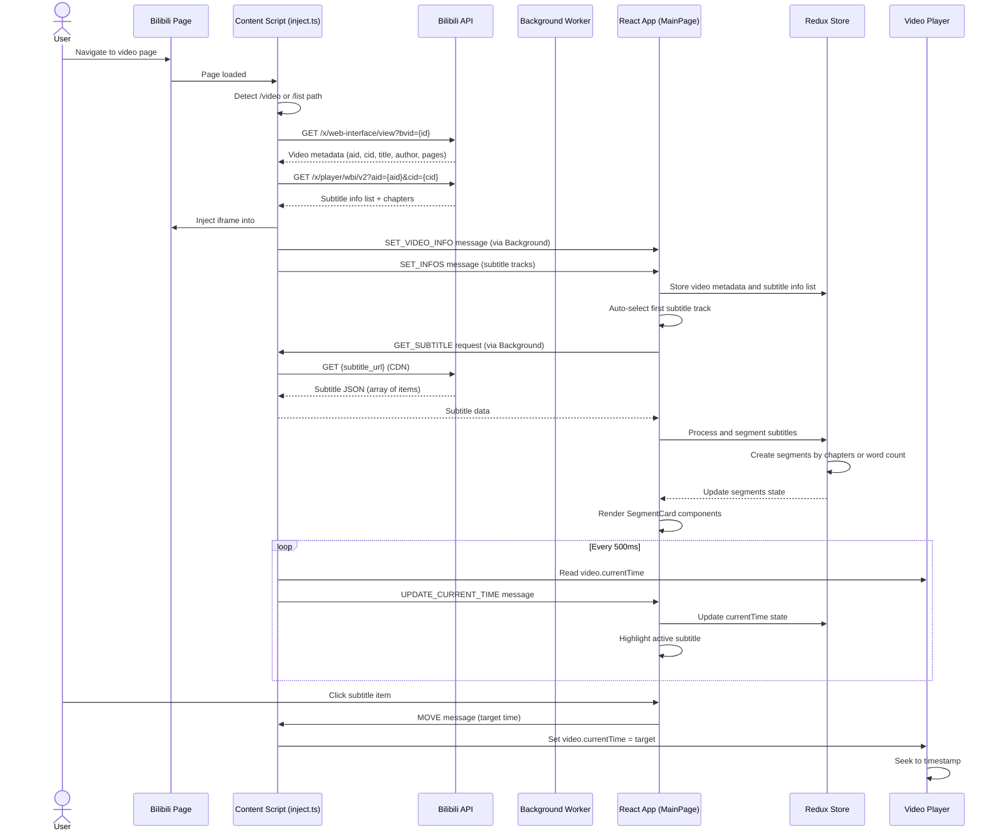
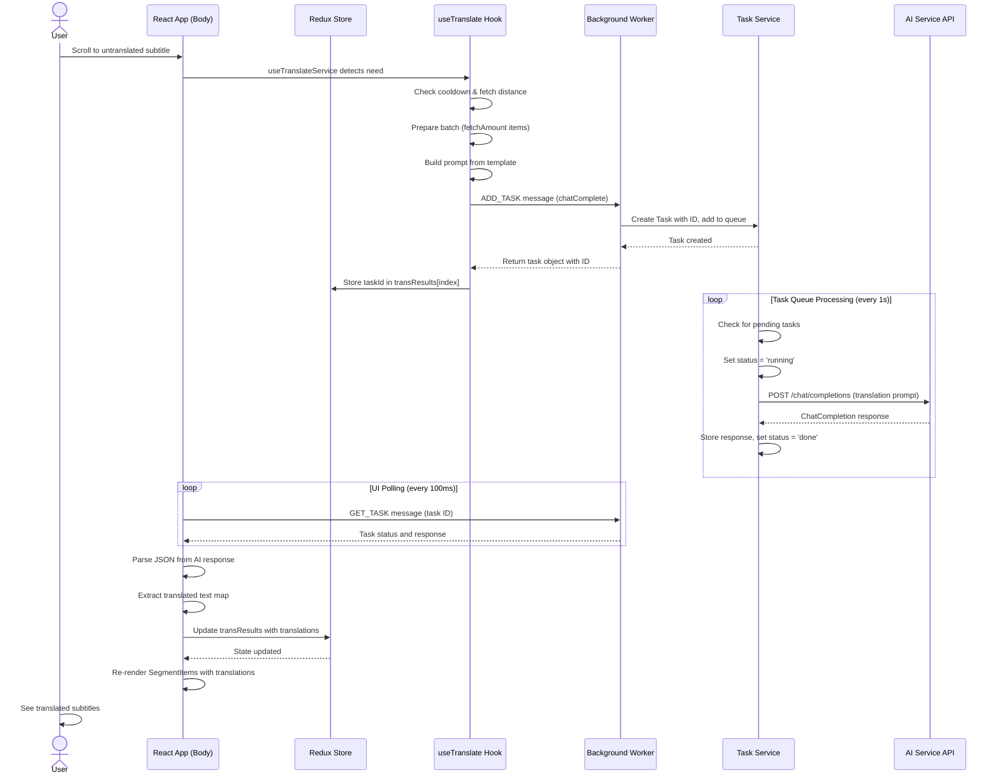
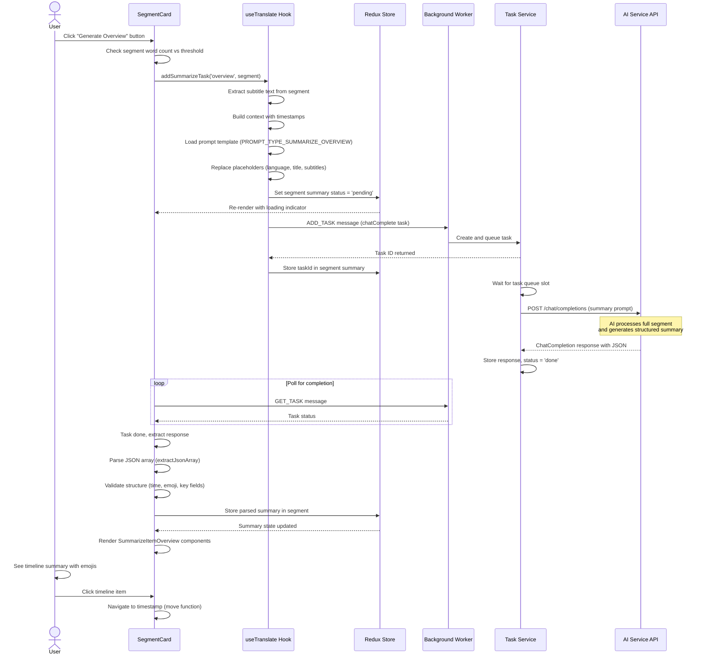
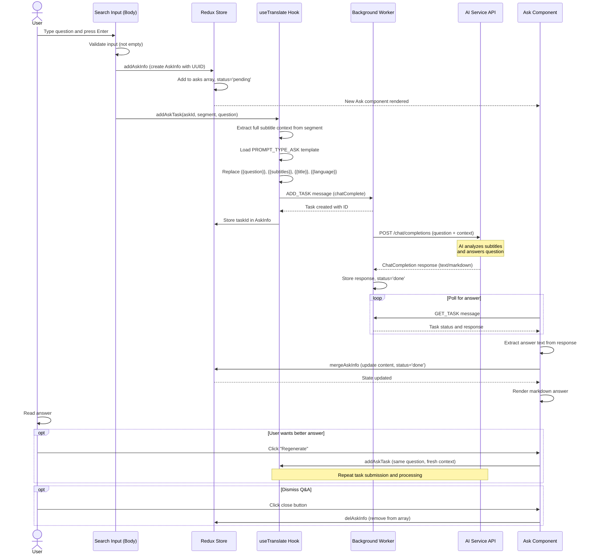
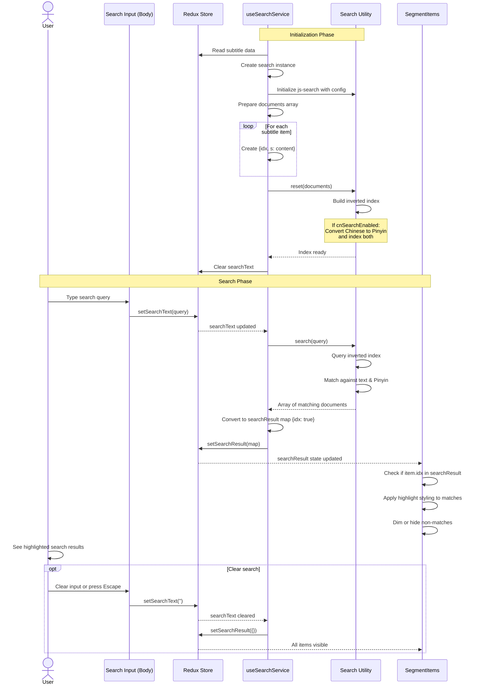
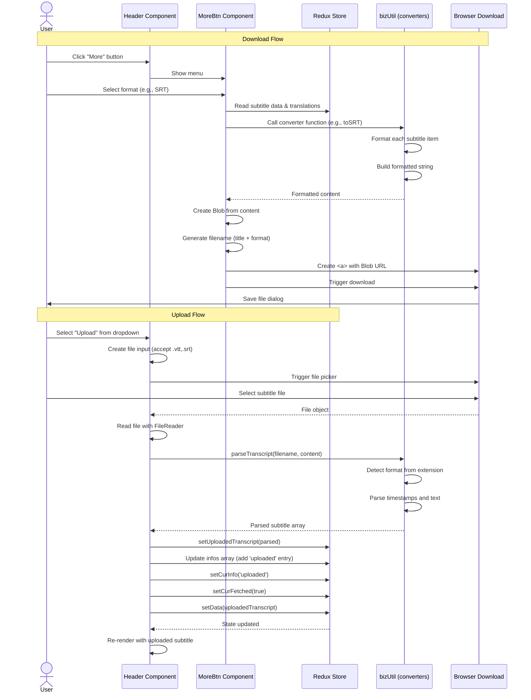

# Bilibili Subtitle Extension - Architecture Analysis

## Project Overview

The **Bilibili Subtitle Extension** (哔哩哔哩字幕列表) is a browser extension designed to enhance the video-watching experience on Bilibili (bilibili.com), China's leading video-sharing platform. The extension provides an intelligent subtitle management interface that displays video subtitles in a structured list format, enabling users to quickly navigate through video content, search within subtitles, and leverage AI-powered features for translation and summarization.

The extension primarily targets educational and knowledge-sharing videos, helping users better understand and extract key information from video content. It serves as a learning companion by transforming passive video watching into an active, searchable, and summarizable experience.

**Main Technologies:**
- **Frontend Framework:** React 18 with TypeScript
- **State Management:** Redux Toolkit (@reduxjs/toolkit)
- **Build Tool:** Vite 3 with @crxjs/vite-plugin for Chrome extension development
- **UI Framework:** DaisyUI + Tailwind CSS for styling
- **Browser APIs:** Chrome Extension Manifest V3 (service workers, content scripts, side panel API)
- **AI Integration:** OpenAI-compatible API (supports OpenAI, Google Gemini, local Ollama models)
- **Search:** js-search library with optional Pinyin search support (tiny-pinyin)
- **Internationalization:** Built-in localization support (primarily Chinese)

## Architecture Overview

The Bilibili Subtitle Extension follows a **modular Chrome Extension architecture** with clear separation between different execution contexts. The system is designed around Chrome Extension Manifest V3, utilizing service workers for background processing and content scripts for page interaction.

The architecture consists of four main layers:

1. **Content Script Layer (Inject)**: Injected into Bilibili video pages to monitor video state, extract metadata, and inject the subtitle UI iframe
2. **Extension UI Layer (App)**: A React-based single-page application that runs in iframes or side panels, providing the main user interface
3. **Background Service Worker Layer**: Handles cross-context messaging, manages AI task queues, and coordinates between different parts of the extension
4. **External Integration Layer**: Communicates with Bilibili APIs for video/subtitle data and AI services for translation/summarization

The system uses a sophisticated **bi-directional messaging system** that enables communication between:
- Content scripts (inject) ↔ Background service worker
- UI app (iframe/sidepanel) ↔ Background service worker
- UI app ↔ Content scripts (via background relay)

Data flows from Bilibili's APIs through the content script, gets processed and displayed in the React UI, and AI features are handled through a task queue system in the background worker. The extension supports two display modes: inline iframe (embedded in the Bilibili page) and browser side panel.

## Key Features

### 1. Subtitle Display and Navigation
**Description:** The core feature that fetches, displays, and enables navigation through video subtitles in a structured timeline format.

**Entry Points:**
- UI: Main subtitle list panel (Body.tsx, SegmentCard.tsx)
- Content Script: `inject.ts` monitors video and fetches subtitles
- API Endpoints: `https://api.bilibili.com/x/player/wbi/v2?aid={aid}&cid={cid}`

**Components & Data:**
- **Components:** MainPage, Body, SegmentCard, SegmentItem, Header
- **State Management:** Redux envReducer (data, segments, curIdx, currentTime)
- **Services:** useSubtitleService hook, InjectMessaging
- **Data:** Subtitle data structure with timestamps, content, and metadata

### 2. AI-Powered Features

#### 2.1 Subtitle Translation
**Description:** Real-time translation of subtitle text into user-selected languages using AI models.

**Entry Points:**
- UI: Toggle in Header component, auto-translate settings
- Background: OpenAI API integration via taskService
- Settings: Language selection in OptionsPage

**Components & Data:**
- **Components:** Header (translation toggle), SegmentItem (displays translations)
- **State Management:** transResults, autoTranslate, language settings
- **Services:** useTranslate, useTranslateService hooks, openaiService
- **Background Tasks:** chatComplete task type in taskService

#### 2.2 Video Summarization
**Description:** Generates AI-powered summaries of video content in multiple formats (overview, key points, questions, debate points, brief summary).

**Entry Points:**
- UI: Summarize buttons in SegmentCard components
- Background: Summary generation via task queue
- API: POST to AI service `/chat/completions`

**Components & Data:**
- **Components:** SegmentCard (summary UI), DebateChat (debate mode)
- **State Management:** summaries stored per segment, summary status tracking
- **Services:** useTranslate hook (addSummarizeTask)
- **Summary Types:** overview, keypoint, question, debate, brief

#### 2.3 Q&A with Video Content
**Description:** Users can ask questions about video content, and the AI provides answers based on subtitle context.

**Entry Points:**
- UI: Search input in Body component (press Enter to ask)
- Background: Question processing via task queue
- Settings: askEnabled configuration

**Components & Data:**
- **Components:** Ask component (displays Q&A), Body (input)
- **State Management:** asks array in Redux state
- **Services:** useTranslate hook (addAskTask)

### 3. Subtitle Search
**Description:** Full-text search through subtitle content with optional Pinyin support for Chinese text.

**Entry Points:**
- UI: Search input in Body component
- Service: useSearchService hook
- Settings: searchEnabled, cnSearchEnabled

**Components & Data:**
- **Components:** Body component (search input and results)
- **State Management:** searchText, searchResult
- **Services:** Search utility (js-search wrapper with Pinyin)
- **Data:** In-memory search index of subtitle content

### 4. Subtitle File Management

#### 4.1 Subtitle Download
**Description:** Export subtitles in multiple formats (SRT, VTT, TXT, JSON, CSV, Markdown).

**Entry Points:**
- UI: More button menu in Header component
- Download triggers: Various format options in MoreBtn component

**Components & Data:**
- **Components:** Header, MoreBtn
- **Format Handlers:** bizUtil functions for each export format

#### 4.2 Subtitle Upload
**Description:** Users can upload custom subtitle files (.srt, .vtt) to overlay on videos.

**Entry Points:**
- UI: Upload option in Header subtitle selector
- File Input: Browser file picker for .vtt/.srt files

**Components & Data:**
- **Components:** Header (upload handler)
- **State Management:** uploadedTranscript, special "uploaded" info entry
- **Parsers:** parseTranscript utility function

### 5. Display Modes

#### 5.1 Inline IFrame Mode
**Description:** Embeds subtitle UI directly into Bilibili video page as an iframe.

**Entry Points:**
- Content Script: Auto-injection in inject.ts
- Injection Target: `#danmukuBox` element on Bilibili pages
- Settings: Default mode (when sidePanel is false)

**Components & Data:**
- **Injection Logic:** createIframe() in inject.ts
- **Communication:** Port-based messaging between iframe and inject
- **Styling:** Dynamic height adjustment based on video player size

#### 5.2 Side Panel Mode
**Description:** Uses Chrome's Side Panel API to display subtitle UI in browser sidebar.

**Entry Points:**
- Browser Action: Click extension icon
- Chrome API: `chrome.sidePanel.open()`
- Settings: sidePanel configuration in OptionsPage

**Components & Data:**
- **Rendering:** sidepanel.html entry point
- **Tab Context:** Each tab can have its own side panel instance
- **Communication:** Tab-scoped messaging via background

### 6. Settings and Configuration
**Description:** Comprehensive configuration page for all extension features and AI integration.

**Entry Points:**
- UI: options.html page
- Access: Right-click extension icon → Options

**Components & Data:**
- **Component:** OptionsPage
- **Settings Categories:**
  - Display preferences (theme, font size, compact mode)
  - AI configuration (API key, server URL, model selection)
  - Feature toggles (translation, summarization, search, Q&A)
  - Language preferences
  - Prompt customization
- **Storage:** Chrome Storage Sync API for cross-device sync

### 7. Video Metadata and Chapter Support
**Description:** Fetches and displays video metadata including chapters/timestamps.

**Entry Points:**
- API: `/x/web-interface/view` and `/x/player/wbi/v2` endpoints
- UI: Chapter-based segmentation (when chapterMode enabled)

**Components & Data:**
- **Metadata:** Title, author, creation time, pages (multi-part videos)
- **Chapters:** Video chapter markers (type: 2) with timestamps
- **Segmentation:** Automatic grouping of subtitles by chapters or word count

## Feature Deep Dives

### Subtitle Display and Navigation

**Overview:**
This feature provides the foundation of the extension - fetching subtitles from Bilibili's servers and displaying them in a navigable, timestamped list. Users can click any subtitle entry to jump to that moment in the video.

**End-to-End Technical Flow:**

1. **Page Detection & Initialization:**
   - Content script (inject.ts) checks if the current page is a Bilibili video page (`/video/*` or `/list/*`)
   - Reads configuration from Chrome Storage to determine display mode (iframe vs side panel)
   - If iframe mode, waits for `#danmukuBox` element to appear, then injects iframe after 1.5s delay

2. **Video Information Extraction:**
   - Every 1 second, content script calls `refreshVideoInfo()` to extract video metadata
   - Parses URL to get video ID (BV ID or AV ID) from path or query parameters
   - Fetches video metadata from Bilibili API endpoints:
     - For BV IDs: `GET /x/web-interface/view?bvid={bvid}`
     - For AV IDs: `GET /x/player/pagelist?aid={aid}`
   - Extracts: aid (numeric ID), cid (video part ID), title, author, pages array, chapters

3. **Subtitle Information Retrieval:**
   - Fetches player info: `GET /x/player/wbi/v2?aid={aid}&cid={cid}`
   - Response contains `subtitle.subtitles` array with available subtitle languages/tracks
   - Each subtitle info has: `id`, `lan` (language code), `lan_doc` (language name), `subtitle_url`
   - Content script sends `SET_VIDEO_INFO` and `SET_INFOS` messages to UI app

4. **Subtitle Content Fetching:**
   - UI app (useSubtitleService hook) detects when a subtitle track is selected
   - Sends `GET_SUBTITLE` message back to content script with subtitle info
   - Content script fetches actual subtitle JSON from `subtitle_url` (Bilibili CDN)
   - Subtitle JSON contains array of subtitle segments with `from`, `to`, `content` fields

5. **Subtitle Processing & Segmentation:**
   - Raw subtitle data is processed in useSubtitleService
   - If `chapterMode` enabled and chapters exist, segments subtitles by chapter boundaries
   - Otherwise, segments by word count threshold (WORDS_RATE * configuredWords)
   - Creates `Segment` objects containing arrays of subtitle items
   - Stores in Redux state: `data` (raw), `segments` (processed)

6. **Display & Synchronization:**
   - Body component renders SegmentCard components for each segment
   - Every 500ms, content script sends current video `currentTime` to UI
   - UI updates Redux state, triggering highlight of current subtitle item
   - SegmentItem components use `isIn` logic to highlight active subtitle

7. **Navigation:**
   - User clicks on subtitle item
   - SegmentItem onClick → useSubtitle.move() → sends `MOVE` message to content script
   - Content script receives message → sets `video.currentTime` to target timestamp
   - Optionally toggles play/pause state

**Mermaid Sequence Diagram:**

**Implementation Index:**
- `src/inject/inject.ts` (lines 131-267) – Video info fetching and subtitle retrieval
- `src/inject/inject.ts` (lines 294-302) – MOVE method for video navigation
- `src/hooks/useSubtitleService.ts` – Subtitle fetching and processing logic
- `src/components/Body.tsx` – Main subtitle list container
- `src/components/SegmentCard.tsx` – Individual segment with subtitle items
- `src/components/SegmentItem.tsx` – Individual subtitle line with click handler
- `src/redux/envReducer.ts` – State management for subtitles and video info
- `src/hooks/useSubtitle.ts` – Navigation helper (move function)

**Limitations / Unknowns:**
- The 1.5s injection delay is a workaround for unknown Bilibili page refresh behavior with fast injection
- WBI v2 API endpoint parameters and authentication mechanism not fully documented
- Some videos may not have subtitles available; error handling relies on empty arrays

---

### AI-Powered Subtitle Translation

**Overview:**
Real-time translation of subtitle content using OpenAI-compatible AI models. Users can select target language and configure translation behavior (manual or automatic). The system uses intelligent batching and cooling to avoid excessive API calls.

**End-to-End Technical Flow:**

1. **Configuration:**
   - User configures in OptionsPage: API key, server URL, AI model, target language
   - Settings stored in Chrome Storage Sync
   - Supports OpenAI, Google Gemini, and local Ollama models

2. **Translation Trigger:**
   - **Auto Mode:** useTranslateService hook monitors current subtitle index (curIdx)
   - When user scrolls to a subtitle not yet translated, checks if translation is needed
   - Uses cooldown mechanism (TRANSLATE_COOLDOWN = time between requests)
   - Fetches next batch when within fetchAmount/2 items of untranslated content
   - **Manual Mode:** User clicks translate button on individual segments

3. **Batch Preparation:**
   - useTranslate.addTask() collects next N subtitle lines (N = fetchAmount, typically 5-10)
   - Creates a JSON map: `{"1": "first line", "2": "second line", ...}`
   - Constructs prompt from template (PROMPT_TYPE_TRANSLATE)
   - Replaces placeholders: `{{language}}`, `{{title}}`, `{{subtitles}}`

4. **Task Creation & Queueing:**
   - Creates TaskDef object with type: 'chatComplete'
   - Includes: model, messages array, temperature, max_tokens
   - Sends ADD_TASK message to background service worker
   - Background worker creates Task object with unique ID, adds to tasksMap

5. **Background Processing:**
   - taskService runs interval loop (1s) checking for pending tasks
   - handleTask() picks up first pending task, sets status to 'running'
   - openaiService.handleChatCompleteTask() makes API call:
     - POST `{serverUrl}/chat/completions`
     - Authorization header with API key
     - Body contains OpenAI chat completion format
   - Handles special URL formatting for Gemini API

6. **Response Processing:**
   - Background worker stores response in task.resp
   - UI polls GET_TASK message every 100ms to check task status
   - When status becomes 'done', extracts result from response
   - Parses JSON response using extractJsonObject() utility
   - Validates response format (expects object with numeric keys)

7. **State Update & Display:**
   - Successfully parsed translations added to Redux transResults array
   - Each transResults[index] contains: code, data (translated text), taskId
   - SegmentItem components read transResults for their index
   - Displays translation based on transDisplay setting:
     - 'originPrimary': Original main, translation sub
     - 'targetPrimary': Translation main, original sub
     - 'origin': Original only
     - 'target': Translation only

8. **Error Handling:**
   - API errors stored in task.error field
   - Displayed as error message in UI
   - Failed translations can be retried
   - Rate limiting and cooldown prevents API spam

**Mermaid Sequence Diagram:**

**Implementation Index:**
- `src/hooks/useTranslate.ts` (lines 33-132) – Translation task creation and prompt building
- `src/hooks/useTranslateService.ts` – Automatic translation triggering logic
- `src/chrome/background.ts` (lines 40-54) – ADD_TASK message handler
- `src/chrome/taskService.ts` – Task queue management and processing
- `src/chrome/openaiService.ts` – AI API communication
- `src/components/SegmentItem.tsx` – Translation display logic
- `src/utils/bizUtil.ts` (getDisplay function) – Translation display mode handling
- `src/consts/const.ts` (lines 214-227) – Translation prompt templates

**Limitations / Unknowns:**
- Translation quality depends on AI model capabilities
- Batch size tradeoff: larger batches more efficient but may hit token limits
- JSON extraction from AI responses can fail if model doesn't follow format
- No persistent translation cache; translations lost on page refresh
- Cooldown mechanism may cause delays in rapid navigation scenarios

---

### AI-Powered Video Summarization

**Overview:**
Generates structured summaries of video content in multiple formats. Users can generate summaries for individual segments or entire videos. Supports five summary types: overview (timeline with key points), key points (bullet list), questions (Q&A format), debate (pros/cons), and brief (one sentence).

**End-to-End Technical Flow:**

1. **Summary Type Selection:**
   - User clicks summarize button on SegmentCard
   - Can choose from dropdown: Overview, Key Points, Brief, Questions, Debate
   - Each type has different prompt template and expected output format

2. **Threshold Check:**
   - System checks segment word count vs SUMMARIZE_THRESHOLD
   - Small segments get automatic summary, large segments require confirmation
   - Prevents wasting tokens on trivial content

3. **Context Preparation:**
   - useTranslate.addSummarizeTask() collects segment subtitle text
   - For "overview" type: includes chapter information if available
   - Builds context string with timestamps and content
   - Constructs prompt from template for selected summary type

4. **Prompt Engineering:**
   - Templates stored in PROMPT_DEFAULTS, customizable in settings
   - Placeholders replaced: `{{language}}`, `{{title}}`, `{{subtitles}}`, `{{chapter}}`
   - Different formats specified for each type:
     - Overview: JSON array with time, emoji, key fields
     - Key Points: JSON array of strings
     - Questions: JSON array of Q&A objects
     - Debate: JSON with positive/negative arrays
     - Brief: Plain text response

5. **Task Submission:**
   - Creates chatComplete task similar to translation
   - Higher max_tokens limit for summaries (varies by type)
   - Sends to background worker via ADD_TASK message
   - Sets segment summary status to 'pending'

6. **Background Processing:**
   - Same task queue system as translation
   - API request to `/chat/completions` endpoint
   - Model processes entire segment context
   - Returns structured response

7. **Response Parsing:**
   - UI polls for task completion
   - Extracts JSON from response (extractJsonArray or extractJsonObject)
   - Validates response structure matches expected format
   - For overview: validates each item has time, emoji, key fields
   - For key points: expects array of strings
   - For questions: expects array with question/answer pairs

8. **Summary Storage & Display:**
   - Parsed summary stored in Redux state under segment
   - Different UI components for each summary type:
     - SummarizeItemOverview: Timeline with emoji + time + key
     - Key points: Numbered list with copy functionality
     - Questions: Expandable Q&A items
     - Debate: Positive/negative columns
     - Brief: Simple text display
   - Summaries can be collapsed/expanded

9. **Floating Summary Feature:**
   - When summarizeFloat enabled, summary can follow scroll
   - Uses Intersection Observer API to track visibility
   - Renders floating summary panel for current segment

10. **Copy & Download:**
    - Each summary type has copy-to-clipboard function
    - Can download summaries as part of subtitle export
    - Format preserved in markdown/JSON exports

**Mermaid Sequence Diagram:**

**Implementation Index:**
- `src/hooks/useTranslate.ts` (lines 133-251) – Summary task creation
- `src/components/SegmentCard.tsx` (lines 18-170) – Summary UI components
- `src/components/DebateChat.tsx` – Debate format summary display
- `src/consts/const.ts` (lines 42-89) – Summary type definitions and prompts
- `src/consts/const.ts` (lines 228-292) – Summary prompt templates
- `src/utils/bizUtil.ts` (extractJsonArray, extractJsonObject) – Response parsing
- `src/chrome/openaiService.ts` – API communication
- `src/redux/envReducer.ts` – Summary state management

**Limitations / Unknowns:**
- Summary quality highly dependent on AI model capabilities
- Long segments may exceed model context windows
- JSON parsing can fail if model doesn't follow format precisely
- No summary regeneration with different models/prompts without clearing
- Summary persistence unclear - may not survive page refreshes
- Token costs can be high for long videos

---

### Q&A with Video Content

**Overview:**
Interactive question-answering feature that allows users to ask questions about video content. The AI analyzes the full subtitle context to provide relevant answers. Questions and answers are displayed in expandable cards and persist during the session.

**End-to-End Technical Flow:**

1. **Question Input:**
   - User types question in search input field (Body component)
   - Press Enter key to submit question
   - System checks if askEnabled is true in configuration

2. **Question Processing:**
   - Input validated and trimmed
   - New AskInfo object created with unique ID (UUID v4)
   - Initial state: status='pending', no content yet
   - Added to Redux asks array

3. **Context Building:**
   - useTranslate.addAskTask() collects full video context
   - Takes first segment (typically entire subtitle set if not segmented)
   - Extracts all subtitle text content
   - Combines into single context string with timestamps

4. **Prompt Construction:**
   - Loads PROMPT_TYPE_ASK template from settings
   - Replaces placeholders:
     - `{{language}}`: User's selected language
     - `{{title}}`: Video title
     - `{{subtitles}}`: Full subtitle context
     - `{{question}}`: User's question
   - Format typically requests markdown response

5. **Task Submission:**
   - Creates chatComplete task with question prompt
   - Sends to background worker via ADD_TASK
   - Stores task ID in AskInfo object
   - UI shows loading indicator

6. **Background Processing:**
   - Background worker processes task in queue
   - Makes API call to AI service
   - Model analyzes full context and question
   - Generates answer (no structured format required, plain text/markdown)

7. **Answer Retrieval:**
   - UI polls GET_TASK to check completion
   - When done, extracts text from AI response
   - Updates AskInfo with content field
   - Sets status='done'

8. **Display:**
   - Ask component renders Q&A card
   - Shows question as header
   - Displays answer with markdown formatting
   - Collapsible to save screen space
   - Close button to remove Q&A

9. **Regeneration:**
   - User can click "Regenerate" button
   - Submits same question again with fresh context
   - Useful if answer was unsatisfactory or context changed

10. **Session Persistence:**
    - Questions/answers stored in Redux state
    - Persist during page session
    - Lost on page refresh or extension reload

**Mermaid Sequence Diagram:**

**Implementation Index:**
- `src/components/Body.tsx` (lines 222-260) – Question input handling
- `src/components/Ask.tsx` – Q&A display component
- `src/hooks/useTranslate.ts` (lines 252-301) – Ask task creation
- `src/redux/envReducer.ts` (addAskInfo, mergeAskInfo, delAskInfo reducers) – Q&A state management
- `src/consts/const.ts` (lines 293-297) – Ask prompt template
- `src/components/Markdown.tsx` – Markdown rendering for answers

**Limitations / Unknowns:**
- Context size limited to first segment; may miss information in later segments
- No conversation history; each question is independent
- No source citation; doesn't reference specific timestamps
- Answer quality depends on model's ability to understand context
- No persistent storage; Q&As lost on refresh
- No sharing or export of Q&As specifically

---

### Subtitle Search

**Overview:**
Full-text search functionality that enables users to quickly find specific content within video subtitles. Supports optional Pinyin search for Chinese text, allowing users to search using Roman characters. Search results highlight matching subtitle items.

**End-to-End Technical Flow:**

1. **Index Initialization:**
   - useSearchService hook initializes when subtitle data loads
   - Creates search instance using Search utility (wrapper around js-search)
   - Configures with index fields: 'idx' (identifier), 's' (search content)
   - If cnSearchEnabled, adds Pinyin conversion to search pipeline

2. **Document Preparation:**
   - Iterates through all subtitle items in data.body array
   - Creates search document for each item: `{idx: number, s: string}`
   - idx: unique subtitle item index
   - s: subtitle content text (searchable field)

3. **Index Building:**
   - Search.reset() called with document array
   - js-search builds inverted index for fast lookup
   - If Pinyin enabled, also indexes Pinyin representation of Chinese text
   - Logs indexing time for performance monitoring
   - Clears any previous search text

4. **Search Execution:**
   - User types in search input (Body component)
   - Redux state updates with searchText value
   - useSearchService detects searchText change via useEffect

5. **Query Processing:**
   - If searchText is empty, clears search results
   - Otherwise, calls Search.search(searchText)
   - js-search performs fuzzy/exact matching (depending on config)
   - If Pinyin enabled, also matches against Pinyin representations
   - Returns array of matching documents

6. **Result Processing:**
   - Creates searchResult object: `{[idx: string]: boolean}`
   - Maps each matching document idx to true
   - Stores in Redux state

7. **UI Updates:**
   - Body component filters segments based on searchResult
   - SegmentCard checks if any items in segment match
   - SegmentItem components get isMatch prop
   - Matching items highlighted with special styling
   - Non-matching items can be hidden or dimmed (based on settings)

8. **Search Clearing:**
   - User clears search input or presses Escape
   - searchText set to empty string
   - searchResult cleared
   - All items become visible again

9. **Performance Optimization:**
   - Debouncing on search input to avoid excessive re-renders
   - Search index cached in closure, no rebuild on re-searches
   - Only re-index when subtitle data changes

**Mermaid Sequence Diagram:**

**Implementation Index:**
- `src/hooks/useSearchService.ts` – Search initialization and execution logic
- `src/utils/search.ts` – Search utility wrapper around js-search
- `src/components/Body.tsx` (lines 169-186) – Search input handling
- `src/components/SegmentCard.tsx` – Segment filtering based on search
- `src/components/SegmentItem.tsx` – Search result highlighting
- `src/redux/envReducer.ts` (searchText, searchResult state) – Search state management
- External: `js-search` library for indexing
- External: `tiny-pinyin` library for Chinese → Pinyin conversion

**Limitations / Unknowns:**
- Search is case-sensitive by default (depends on js-search config)
- No regex or advanced query syntax
- Pinyin search may have ambiguity issues (multiple Chinese characters → same Pinyin)
- Search index must be rebuilt when subtitle data changes
- No search history or saved searches
- Performance may degrade with very large subtitle sets (>10,000 items)
- No search result count displayed
- No "jump to next result" navigation

---

### Subtitle Download and Upload

**Overview:**
Users can export subtitles in multiple popular formats for use in other applications, or upload custom subtitle files to overlay on videos without native Bilibili subtitles.

#### Subtitle Download

**End-to-End Technical Flow:**

1. **Download Trigger:**
   - User clicks "More" button in Header component
   - MoreBtn menu appears with download options
   - Format choices: SRT, VTT, TXT, JSON, CSV, MD (Markdown), Audio

2. **Format Selection:**
   - User selects desired format from dropdown
   - MoreBtn.onDownload() handler triggered with format type

3. **Data Preparation:**
   - Collects subtitle data from Redux state (data.body array)
   - Each item has: idx, from, to, content fields
   - May include translations if available (transResults)

4. **Format Conversion:**
   - Different converter function for each format (in bizUtil.ts):
     - **SRT:** Numbers, timestamp (HH:MM:SS,mmm --> HH:MM:SS,mmm), text, blank line
     - **VTT:** "WEBVTT" header, timestamp (HH:MM:SS.mmm --> HH:MM:SS.mmm), text
     - **TXT:** Plain text, one line per subtitle
     - **JSON:** Array of objects with from, to, content
     - **CSV:** Comma-separated: index, start, end, text
     - **MD:** Markdown table with headers and rows

5. **File Generation:**
   - Formatted string/JSON converted to Blob
   - Blob type set appropriately (text/plain, application/json, etc.)
   - Filename generated: `{videoTitle}_{format}.{ext}`

6. **Download Execution:**
   - Create temporary anchor element (`<a>`)
   - Set href to Blob URL (URL.createObjectURL)
   - Set download attribute with filename
   - Programmatically trigger click
   - Cleanup Blob URL

7. **Special Case - Audio Download:**
   - Sends DOWNLOAD_AUDIO message to content script
   - Content script extracts audio URL from page HTML (window.__playinfo__)
   - Fetches audio blob from Bilibili CDN
   - Downloads as .m4s file

#### Subtitle Upload

**End-to-End Technical Flow:**

1. **Upload Trigger:**
   - User clicks "Upload" option in Header subtitle selector dropdown
   - Or selects "upload" from subtitle track dropdown

2. **File Selection:**
   - Creates hidden file input element
   - Sets accept filter: `.vtt, .srt`
   - Triggers click to open file picker
   - User selects local subtitle file

3. **File Reading:**
   - FileReader API reads file as text
   - onload handler receives file content as string

4. **Parsing:**
   - parseTranscript() utility function called with filename and content
   - Detects format from file extension:
     - `.vtt` → VTT parser
     - `.srt` → SRT parser
   - Parses timestamps and text content
   - Converts to internal format: array of {from, to, content}

5. **Storage:**
   - Stores parsed subtitle in uploadedTranscript Redux state
   - Creates special subtitle info object: `{id: 'uploaded', subtitle_url: 'uploaded', lan_doc: '上传的字幕'}`
   - Removes any existing uploaded subtitle from infos array
   - Adds new uploaded info to infos array

6. **Display:**
   - Sets uploaded subtitle as curInfo (current selected subtitle)
   - Sets curFetched to true (no network fetch needed)
   - Sets data to uploadedTranscript
   - UI renders uploaded subtitle in segment list

7. **Persistence:**
   - Uploaded subtitle stored in Redux only (not persisted)
   - Lost on page refresh or extension reload
   - User must re-upload if needed

**Mermaid Sequence Diagram:**

**Implementation Index:**
- `src/components/Header.tsx` (lines 21-51) – Upload handling
- `src/components/MoreBtn.tsx` – Download menu and format selection
- `src/utils/bizUtil.ts` (toSRT, toVTT, toTXT, toJSON, toCSV, toMD functions) – Format converters
- `src/utils/bizUtil.ts` (parseTranscript function) – Subtitle file parser
- `src/inject/inject.ts` (lines 377-388) – DOWNLOAD_AUDIO handler

**Limitations / Unknowns:**
- Upload only supports VTT and SRT formats; other formats not parsed
- No validation of uploaded subtitle timing against video duration
- Uploaded subtitles not persisted; lost on page reload
- No editing capability for uploaded subtitles
- Audio download relies on parsing page HTML; may break with Bilibili changes
- No multi-track upload; only one uploaded subtitle at a time
- Downloaded files may not preserve subtitle styling/formatting
- No download progress indicator for large files

---

## Unknowns and Assumptions

### Architecture Ambiguities

1. **Bilibili API Authentication:**
   - The extension uses `credentials: 'include'` when fetching from Bilibili APIs, relying on browser cookies
   - The `/x/player/wbi/v2` endpoint includes "wbi" in the path, suggesting some form of Web-Based Interface authentication
   - The exact authentication mechanism and required parameters are not documented in the code
   - **Evidence:** All API calls in `inject.ts` use `credentials: 'include'`
   - **Next Steps:** Examine Bilibili's official documentation or reverse-engineer the WBI authentication scheme

2. **Port vs Message Communication:**
   - The messaging system supports both Port-based (persistent connection) and Message-based (one-off) communication
   - `DEFAULT_USE_PORT` is set to `false`, but the actual decision logic appears complex
   - Not clear when/why port mode would be preferred over message mode
   - **Evidence:** `const.ts` line 1, messaging layer code has dual implementation
   - **Next Steps:** Review Chrome extension best practices for port vs message usage patterns

3. **Task Expiration and Cleanup:**
   - Tasks in the background worker expire after `TASK_EXPIRE_TIME` (value not shown in reviewed code)
   - Not clear what happens to tasks that expire while still pending or running
   - **Evidence:** `taskService.ts` lines 41-50 show cleanup logic
   - **Next Steps:** Find TASK_EXPIRE_TIME constant definition and test expiration behavior

4. **Side Panel vs IFrame Decision:**
   - Two distinct UI modes supported, but decision logic for when to use each is not fully clear
   - `manualInsert` and `sidePanel` flags control behavior
   - User can switch modes, but implications of switching mid-session not documented
   - **Evidence:** `inject.ts` lines 111-121, `background.ts` lines 101-122
   - **Next Steps:** Document user scenarios for each mode and switching behavior

### Feature Completeness Questions

5. **Translation Cache:**
   - Translations appear to be session-only; no persistent cache mentioned
   - Re-visiting a video would require re-translating all content
   - Could be expensive with frequent use
   - **Evidence:** No storage logic found for transResults in code review
   - **Next Steps:** Check if Chrome Storage is used elsewhere for translation cache

6. **Summary Persistence:**
   - Similar to translations, summaries appear session-only
   - No code found for saving/loading summaries
   - **Evidence:** Summary state only in Redux, not written to Chrome Storage
   - **Next Steps:** Verify if summaries persist across page reloads

7. **Error Recovery:**
   - Background task failures store error messages, but no automatic retry logic visible
   - Network failures during subtitle fetch may not have robust recovery
   - **Evidence:** `taskService.ts` catches errors but only logs them
   - **Next Steps:** Test failure scenarios and document expected behavior

8. **Internationalization:**
   - Code has `default_locale: "zh_CN"` and `_locales` directory
   - Most UI text is hardcoded in Chinese
   - Not clear if full i18n support is implemented or planned
   - **Evidence:** `manifest.config.ts` line 18, hardcoded Chinese strings throughout components
   - **Next Steps:** Review `public/_locales` directory structure

### Performance and Scale

9. **Large Video Handling:**
   - No obvious limits on subtitle count or video duration
   - Search indexing and segment rendering may have performance issues with very long videos (3+ hours)
   - **Evidence:** No pagination or virtualization in SegmentCard rendering
   - **Next Steps:** Test with exceptionally long videos, add performance monitoring

10. **AI Token Limits:**
    - Prompts include full subtitle context for summaries and Q&A
    - Long videos may exceed model context windows (e.g., 4K tokens for some models)
    - No truncation or chunking logic visible
    - **Evidence:** `useTranslate.ts` builds full context strings
    - **Next Steps:** Add context length checks and chunking for long videos

11. **Rate Limiting:**
    - Translation uses cooldown mechanism (TRANSLATE_COOLDOWN)
    - No rate limiting visible for summarization or Q&A features
    - Could hit AI service rate limits with rapid use
    - **Evidence:** `useTranslate.ts` line 56 checks lastTransTime
    - **Next Steps:** Add rate limiting to all AI features

### Security Considerations

12. **API Key Storage:**
    - API keys stored in Chrome Storage Sync (synced across devices)
    - Stored as plain text, not encrypted
    - **Evidence:** OptionsPage reads/writes apiKey to Chrome Storage
    - **Next Steps:** Consider encryption or recommend users use restricted API keys

13. **Content Security Policy:**
    - README mentions CSP errors during development
    - use_dynamic_url workaround applied via fix.cjs
    - Not clear if this is fully resolved or has security implications
    - **Evidence:** README lines 49-51, fix.cjs script
    - **Next Steps:** Verify CSP compliance in production builds

### Assumptions Made

- **Assumption 1:** Bilibili's API structure and endpoints are stable and will not change frequently
- **Assumption 2:** Users have valid API keys for AI services before using translation/summarization features
- **Assumption 3:** Subtitle URLs from Bilibili API are always accessible without additional authentication
- **Assumption 4:** The extension is primarily used for videos with existing subtitles, not for generating subtitles from audio
- **Assumption 5:** Users are comfortable with Chinese UI (primary language)
- **Assumption 6:** Chrome Storage Sync is sufficient for user settings (no backend database needed)
- **Assumption 7:** Single-threaded task queue in background worker is sufficient for typical usage patterns
- **Assumption 8:** Users understand AI service costs and manage their own API usage/billing

---

*This architecture analysis was generated based on code review of the Bilibili Subtitle Extension repository. All diagrams and technical details are grounded in actual source code as of the analysis date. For questions or clarifications about specific implementation details, refer to the Implementation Index sections which provide exact file paths and line numbers.*
